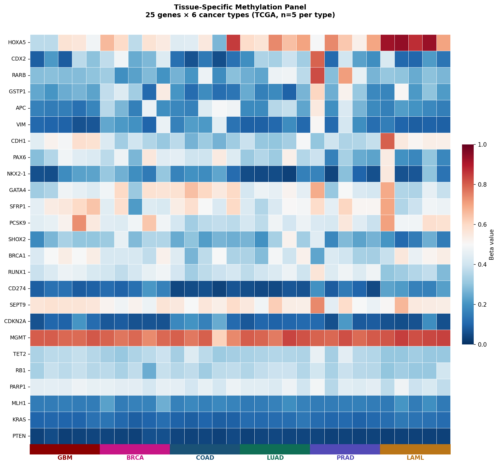
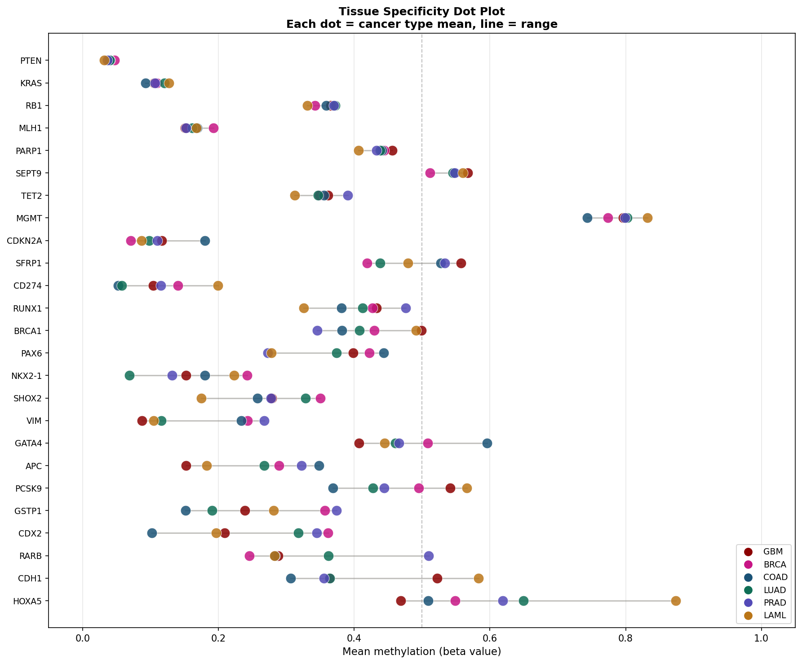
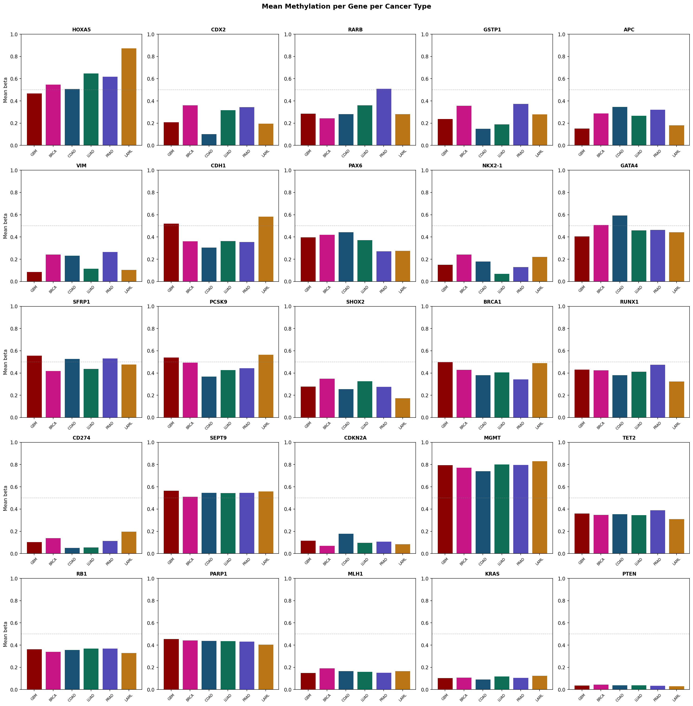

# Methylation Tissue Classifier

A Python pipeline for tissue-specific DNA methylation analysis using a curated 25-gene panel across 6 cancer types from TCGA.

## Biological motivation

DNA methylation patterns are highly tissue-specific and are preserved in cancer cells, making them powerful biomarkers for tissue-of-origin classification. This project builds a literature-curated methylation panel targeting genes known to show tissue-specific silencing across brain, breast, colon, lung, prostate, and blood cancers — directly relevant to liquid biopsy and cancer diagnostics applications.

## Gene panel (25 genes)

| Category | Genes |
|----------|-------|
| Tumor suppressors | APC, MLH1, BRCA1, SFRP1, CDH1, PTEN, RB1, RARB |
| Cell cycle | CDKN2A |
| Tissue-specific TFs | HOXA5, CDX2, PAX6, GATA4, NKX2-1 |
| Cancer biomarkers | GSTP1, MGMT, SEPT9, SHOX2, VIM |
| Immune checkpoint | CD274 |
| DNA repair | PARP1 |
| Signaling | KRAS |
| Metabolism | PCSK9 |
| Hematopoietic TFs | RUNX1, TET2 |

## Key findings

- **13/25 genes** significantly differentially methylated across cancer types (Kruskal-Wallis, FDR<0.05)
- **HOXA5** shows largest differential (Δ=0.405, highest in LAML, lowest in GBM)
- **GSTP1** correctly identifies prostate cancer as highest methylation — validates panel against literature
- **PCSK9** significant across tissue types (FDR=0.015) — novel metabolic gene methylation finding
- **CD274** significant (FDR=0.013) — connects to immune checkpoint biology

## Cancer types

| Cancer | TCGA cohort | Tissue | Samples |
|--------|-------------|--------|---------|
| GBM | TCGA-GBM | Brain | 5 |
| BRCA | TCGA-BRCA | Breast | 5 |
| COAD | TCGA-COAD | Colon | 5 |
| LUAD | TCGA-LUAD | Lung | 5 |
| PRAD | TCGA-PRAD | Prostate | 5 |
| LAML | TCGA-LAML | Blood | 5 |

## Figures

### Tissue-specific methylation heatmap


### Tissue specificity dot plot


### Mean methylation per gene per cancer type


## Notebooks

| Notebook | Description |
|----------|-------------|
| 01_ccle_methylation_panel.ipynb | Data download, QC, gene panel extraction, all visualizations |

## Installation

```bash
git clone https://github.com/bmurnyak/methylation-tissue-classifier.git
cd methylation-tissue-classifier
conda activate glioma-meth
pip install scikit-learn
```

## Data sources
- TCGA 450k methylation: [GDC portal](https://portal.gdc.cancer.gov)
- 450k manifest: Illumina HumanMethylation450 v1.2

## Next steps
- [ ] PCA plot — tissue separation visualization
- [ ] Random forest classifier — tissue-of-origin prediction
- [ ] Scale to 20+ samples per cancer type
- [ ] Correlation heatmap between genes
- [ ] Interactive HTML report

## Author

**Balazs Murnyak, PhD** — Molecular Biologist and Genomics Scientist  
University of Utah  
[LinkedIn](https://www.linkedin.com/in/balazs-murnyak-56a45a100/) | [Google Scholar](https://scholar.google.com/citations?user=dFfVIEAAAAJ)
