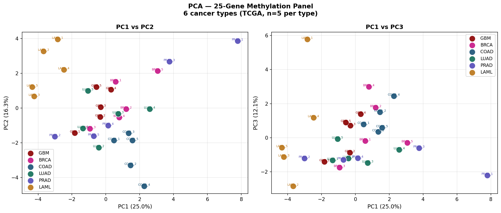
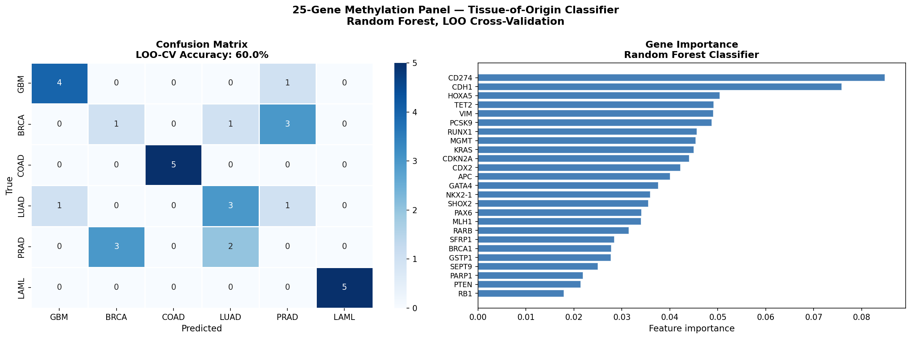
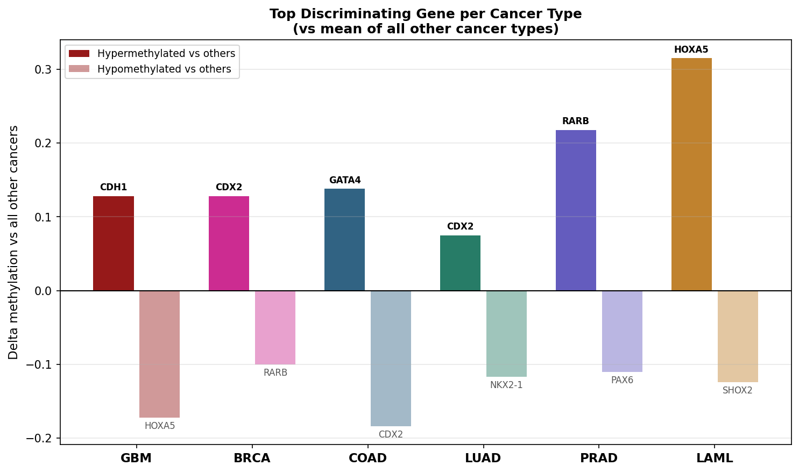
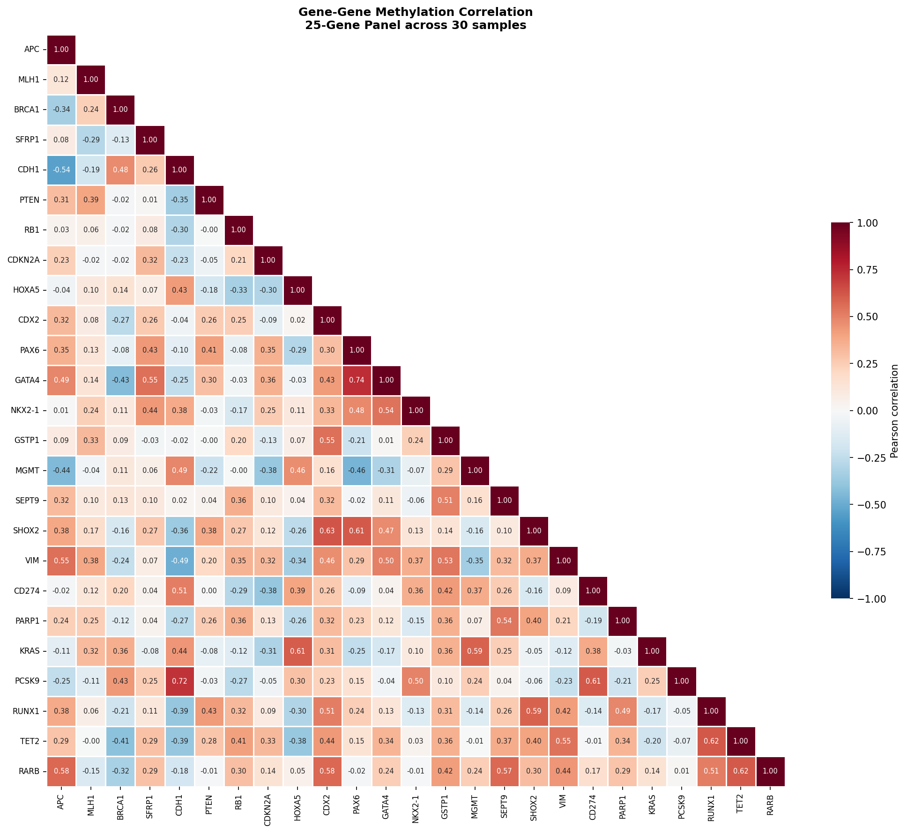

# Methylation Tissue Classifier

A Python pipeline for tissue-specific DNA methylation analysis using a curated 25-gene panel across 6 cancer types from TCGA. Demonstrates methylation-based tissue-of-origin classification — the epigenomic foundation of liquid biopsy diagnostics.

## Biological motivation

DNA methylation patterns are highly tissue-specific and preserved in cancer cells, making them powerful biomarkers for tissue-of-origin classification. This project builds a literature-curated methylation panel targeting genes known to show tissue-specific silencing — directly relevant to liquid biopsy and cancer diagnostics applications (cf. Grail Galleri, Foundation Medicine).

## Gene panel (25 genes)

| Category | Genes | Tissue bias |
|----------|-------|-------------|
| Tumor suppressors | APC, MLH1, BRCA1, SFRP1, CDH1, PTEN, RB1, RARB | Pan-cancer / tissue-specific |
| Cell cycle | CDKN2A | Pan-cancer |
| Tissue-specific TFs | HOXA5, CDX2, PAX6, GATA4, NKX2-1 | Blood, Colon, Brain, GI, Lung |
| Cancer biomarkers | GSTP1, MGMT, SEPT9, SHOX2, VIM | Prostate, Brain, Colon, Lung |
| Immune checkpoint | CD274 | Pan-cancer |
| DNA repair | PARP1 | Brain |
| Signaling | KRAS | Pan-cancer |
| Metabolism | PCSK9 | Pan-cancer |
| Hematopoietic TFs | RUNX1, TET2 | Blood |

## Key findings

### Statistical analysis
- **13/25 genes** significantly differentially methylated across cancer types (Kruskal-Wallis, FDR<0.05)
- **HOXA5** largest differential (Δ=0.405, LAML vs GBM)
- **GSTP1** correctly identifies prostate — validates panel against literature
- **PCSK9** significant (FDR=0.015) — novel metabolic gene methylation finding

### Top discriminating genes per cancer type
| Cancer | Best marker | Delta vs others |
|--------|-------------|-----------------|
| GBM | CDH1 | +0.128 |
| BRCA | CDX2 | +0.128 |
| COAD | GATA4 | +0.140 |
| LUAD | CDX2 | +0.076 |
| PRAD | RARB | +0.219 |
| LAML | HOXA5 | +0.316 |

### Random forest classifier (LOO-CV)
- **60% overall accuracy** with only 5 samples per group
- **COAD: 5/5 correct** — colon most epigenetically distinct
- **LAML: 5/5 correct** — blood separates perfectly (confirmed by PCA)
- Top features: CD274, CDH1, HOXA5, TET2, VIM

### PCA
- PC1 (25%) separates LAML from solid tumors
- PC2 (16.3%) separates PRAD from others
- 53.4% variance explained in 3 PCs

### Gene correlations
- PAX6 ↔ GATA4 (r=0.74) — developmental TF co-regulation
- RUNX1 ↔ TET2 (r=0.62) — blood epigenetic axis
- CDH1 ↔ PCSK9 (r=0.72) — novel co-methylation finding

## Figures

### Tissue-specific methylation heatmap


### PCA — cancer type separation


### Random forest classifier


### Top discriminating genes per cancer type


### Gene-gene correlation heatmap


### Tissue specificity dot plot


## Installation

```bash
git clone https://github.com/bmurnyak/methylation-tissue-classifier.git
cd methylation-tissue-classifier
conda activate glioma-meth
pip install scikit-learn
```

## Data sources
- TCGA 450k methylation: [GDC portal](https://portal.gdc.cancer.gov)
- 450k manifest: Illumina HumanMethylation450 v1.2 (download separately)

## Next steps
- [ ] Scale to 20+ samples per cancer type for improved classifier accuracy
- [ ] Add WGBS validation for key tissue-specific CpG sites
- [ ] Interactive HTML report
- [ ] Extend to 10+ cancer types

## Author

**Balazs Murnyak, PhD** — Molecular Biologist and Genomics Scientist  
University of Utah  
[LinkedIn](https://www.linkedin.com/in/balazs-murnyak-56a45a100/) | [Google Scholar](https://scholar.google.com/citations?user=dFfVIEAAAAJ)
